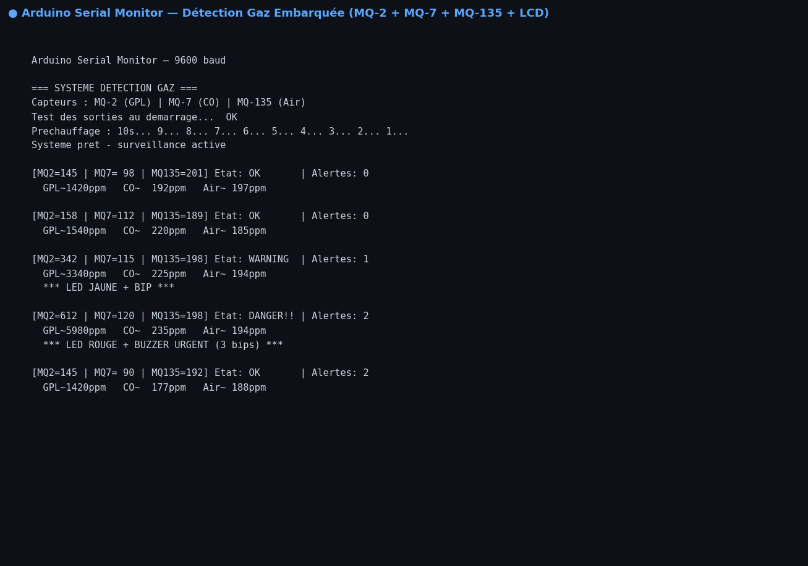

# 🚨 Détection de Gaz Embarquée — Arduino Uno

Système d'alarme embarqué pour la détection de gaz dangereux en temps réel. Trois capteurs MQ couvrent les principaux risques : GPL/fumée, monoxyde de carbone et qualité de l'air. Déclenche une alarme sonore et visuelle selon le niveau de danger détecté.

## 📸 Aperçu — Serial Monitor Arduino



## 🎯 Fonctionnalités

- **3 capteurs MQ** lus en continu avec moyenne sur 5 échantillons (anti-bruit)
- **3 niveaux d'alerte** : ✅ OK → ⚠️ WARNING (bip + LED jaune) → 🚨 DANGER (buzzer urgent + LED rouge)
- Affichage valeurs sur **LCD 16×2 I2C** en temps réel
- Test automatique des LEDs et buzzer au démarrage
- Feedback complet **Serial Monitor** (valeurs ADC + ppm estimés)
- Conversion ADC → ppm (calibrable selon datasheet)

## 🔧 Matériel

| Composant | Référence | Gaz détecté |
|-----------|-----------|-------------|
| Microcontrôleur | Arduino Uno (ATmega328P) | — |
| Capteur GPL / Fumée | MQ-2 | Propane, butane, fumée |
| Capteur CO | MQ-7 | Monoxyde de carbone |
| Capteur CO2 / Air | MQ-135 | CO2, NH3, alcool, benzène |
| Affichage | LCD 16×2 + module I2C | — |
| Alarme sonore | Buzzer 5V actif | — |
| LED Rouge | 5 mm + 220Ω | Niveau DANGER |
| LED Jaune | 5 mm + 220Ω | Niveau WARNING |
| LED Verte | 5 mm + 220Ω | Niveau OK |

## 📌 Schéma de câblage

```
Arduino Uno
├── A0  → MQ-2   AOUT  (GPL / Fumée)
├── A1  → MQ-7   AOUT  (CO)
├── A2  → MQ-135 AOUT  (CO2 / Air)
├── A4  → LCD SDA  (I2C)
├── A5  → LCD SCL  (I2C)
├── D8  → Buzzer +
├── D9  → LED Rouge  (via 220Ω)
├── D10 → LED Jaune  (via 220Ω)
└── D11 → LED Verte  (via 220Ω)
```

> ⚠️ Les capteurs MQ nécessitent **24h de chauffe** avant calibration précise.

## ⚠️ Seuils d'alerte (ADC 0–1023)

| Capteur | Seuil WARNING | Seuil DANGER |
|---------|--------------|--------------|
| MQ-2 (GPL) | 300 | 600 |
| MQ-7 (CO) | 200 | 500 |
| MQ-135 (Air) | 300 | 650 |

## 📚 Librairies requises

```
LiquidCrystal_I2C  — Frank de Brabander (Gestionnaire bibliothèques Arduino)
Wire               — Intégrée Arduino IDE
```

## 🚀 Téléversement

1. Ouvrir `detection_gaz/detection_gaz.ino` dans **Arduino IDE**
2. Sélectionner **Arduino Uno** + port COM
3. **Vérifier** → **Téléverser**
4. Serial Monitor à **9600 baud**

## 🛠️ Technologies

**C++ Arduino** · **ADC 10 bits** · **I2C** · **PWM buzzer** · **GPIO**

## 👩‍💻 Auteure

**Vanelle Stéphanie MANGOUA DJOUSSEU** — Recherche d'alternance en IA & Systèmes Embarqués
